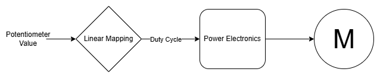
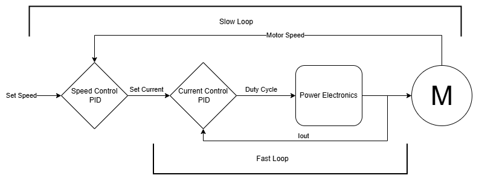
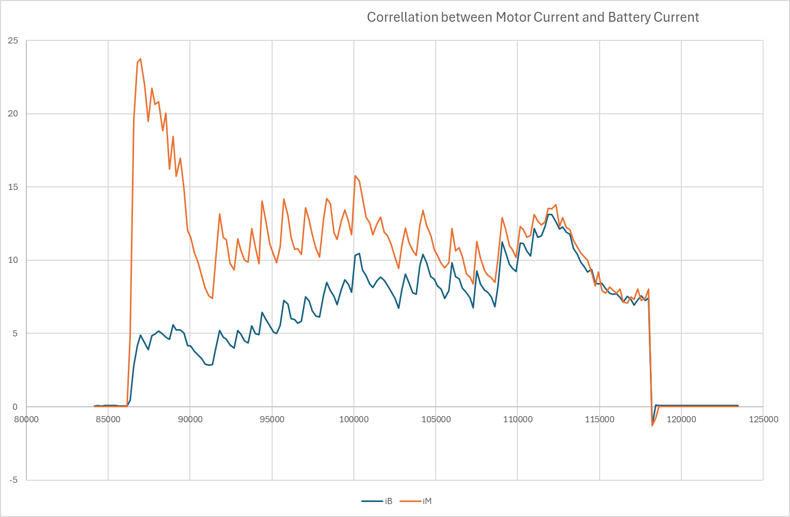
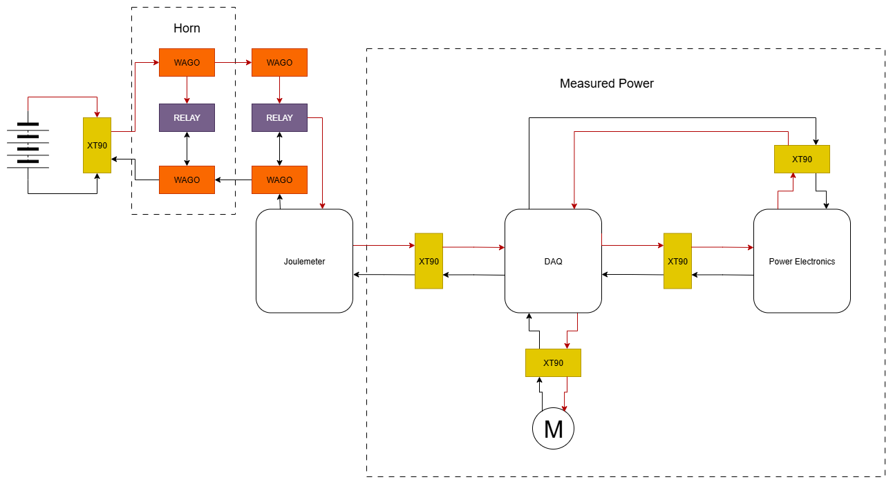
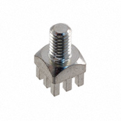
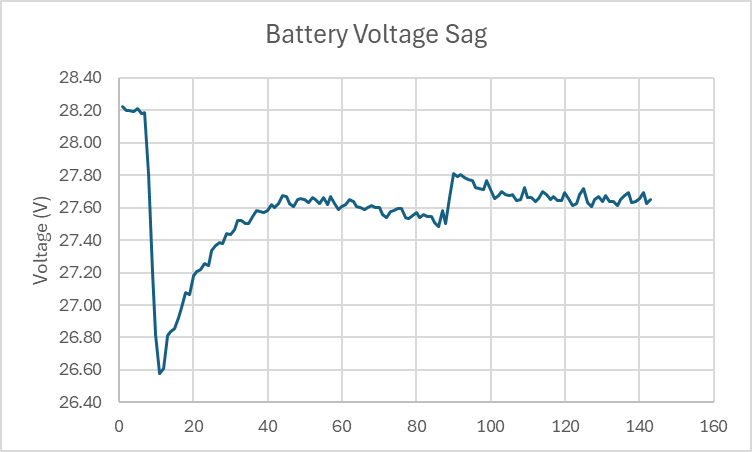
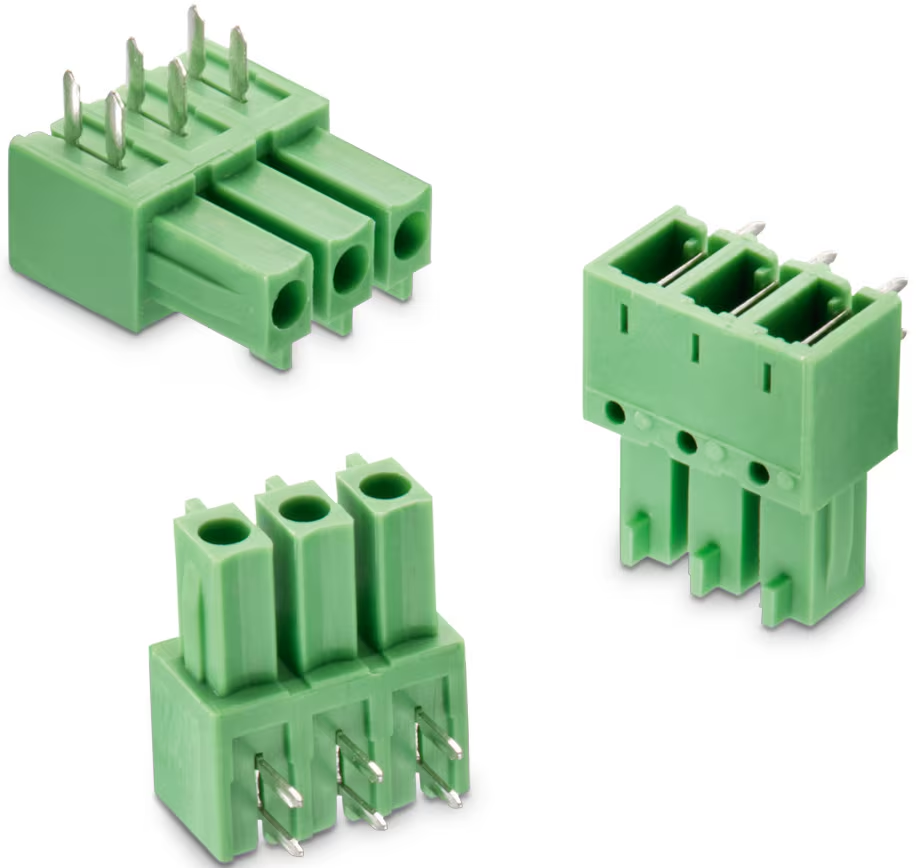
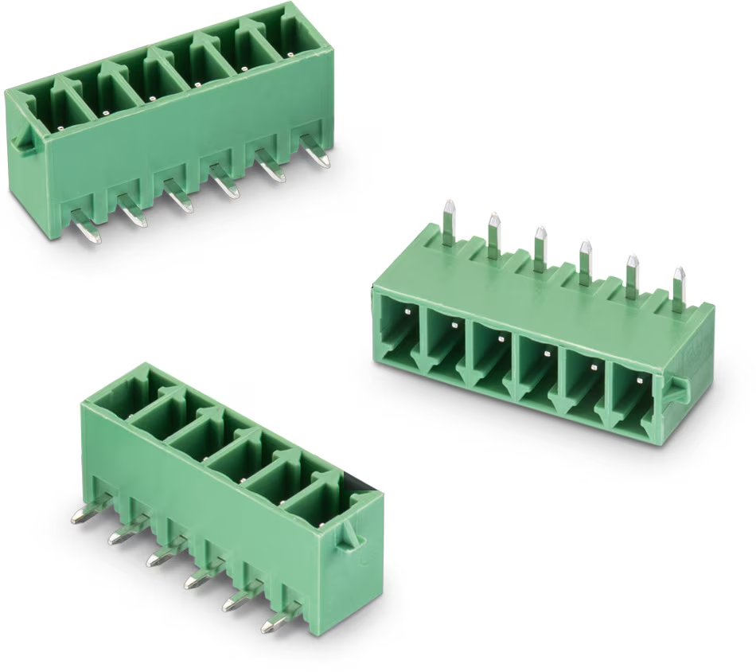
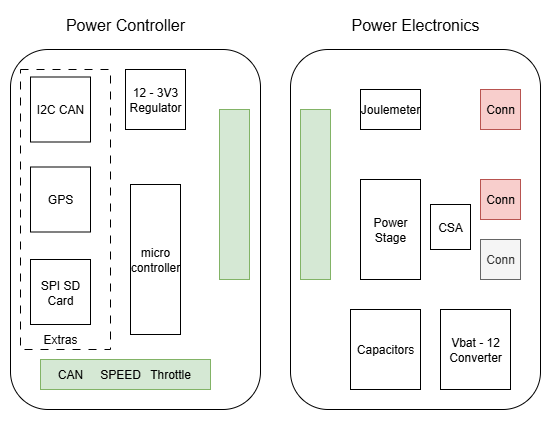

# Justification for the new Design of Power Electronics

This document is a summary of reasons why the power electronics should be redesigned and a comparison with a new power electronics board
It is broken down into the following sections:
1. Closed Loop Control
   - A closed loop controller would require an accurate current sensor and either a speed sensor or an analogue for speed sensing
   - The current sensor on the power electronics is low bandwidth and placed at the battery terminal, resulting in a phase difference between the motor current and battery current due to the large Capacitors
2. Simplify the high current path through the circuit
   - A small PCB with only the required components, and a common IO platform that a DAQ/Power Controller can be designed around
3. Switching Losses
   - GaN FETs have smaller gates losses compared with either the originally designed MOSFETs or the current FETs
4. Modularity and common supply voltage
   - All additional devices and board are supplied directly from the battery along the main current path. This cause the major issue that the high current loop goes through each section individually

## Closed Loop Control

Above is a diagram showing the control methodolgy for the current power electronics, it is an open loop controller i.e. no feedback.
The Linear mapping update frequency and max change in duty cycle can be modified to a more conservative requirements, which will should prevent massive current spikes. 
Additionally the linear mapping could be changed to a logarthmic mapping to allow for finer control at higher duty cycles. 

The requirements for a control system described above are:
1. Accurate Motor current
2. Reliable Motor Speed value

The 2 requirements are present on the Geec at the moment however they exist on the DAQ without an easy method of communicating between the two boards. Communicating with the DAQ also adds latency issues which would need to be controlled for. 
There is bandwidth issues too, the 2 current sensors (ACS712, ACS723) in the Geec have bandwidths of 80kHz. Shunt based sensors can have much higher bandwidths e.g. INA241 with a bandwidth of 1.1MHz. This can allow much better knowledge of current transients and a better understanding of the vehicle.
Below is a curve showing the Battery current and the motor current as reported by the DAQ current sensor

A new Power Electronics board could contain this shunt sensor to monitor the output current accurately.

## High Current Path

The diagram above details the main electrical current path which every amp must travel to reach the motor. 
Here are some fixes which would improve the series resistance and the total return path length of the system:
1. Swap the horn and main electrical relays. This would mean only pair set of Wago's would need to be connected through lowering some contact resistance.
2. Removal of the DAQ would not only remove 2 XT90's but also the series resistance from the DAQ.
3. Removal of the XT90's from the circuit after the Joulemeter. 

Above is a press fit M4 connector rated for up to 130A, this would be combined with a ring crimp connector to achieve very low resistances.

## Switching Losses

I'm in the process of simulating the switching losses present in the current circuit, however I'm looking at GaN power FETs with integrated drivers and very low gate charges and moderately low Rdson.

The likely result is they will have at worst the equivalent characteristics of the power MOSFETs on the Power Electronics right now, except they will be rated for 60-100V instead of 30V. 
The current FETs likely have higher breakdown voltages than the datasheet states and there are TVS diodes which if rated for 30V will suppress any transients voltages greater than 30V, but I'm personally not comfortable with the gamble. 

## Modularity and Supply Voltages
An issue related to the one described in section 2 is that all devices currently use the main battery voltage as the main supply voltage. This creates issues with stability and noise propogation. A single step down supply, that does, would make design:
Vbat -> 12V
The supply wouldn't need to be massive either: 0.6-1A would be able to output 7-12W and well designed converters have minimum 90% efficiencies. All other boards would then require a 12V->5V or 12V->3.3V converter, which can be readily found with efficiencies from 75% up to 95% efficient. 

The modularity would be achieved with these connectors:

Which have a pair as shown:

The above connectors can easily be connected and disconnected but have very high gripping forces. A 12 pin connector could have the following pins:
1. 12V
2. GND
3. SDA (power meter)
4. SCL (power meter)
5. PWMH
6. PWML
7. Imot (analog)
8. Vmot (analog)
9. Sleep
10. 3.3V
11. GND
12. SPARE (5V?)

This allows for a number of options, 
1. The placement of the DAQ could be in series with the power controller board, reporting data from the device, before transmission to the power controller.
2. The method of PWM control could be altered with a board change:
   1. Software PID control
   2. Hardware peak current control, using discrete logic gates and comparators.
   3. Addition of DAQ sensors (GPS, SD card, CAN device, Speed Sensor) and integration into control
   4. More advanced control schemes or more basic controls.
3. Better design considerations. 
   1. The power electronics board has many requirements, high current paths, potentially noisy grounds, high di/dt and dv/dt nodes, heatsink requirements, etc. This could be designed with a tight 4 layer board with solid ground and power planes to allow for parrallel connections with small power loops.
   2. The power controller boards have different requirements, mainly high speed digital signals and some analog signal measurement. This could be designed with a 2 layer board and large amounts of IO outputs to keep the devices versatile

## Diagram of new power board design

| Device  | Purpose   |
|---|---|
|INA241   |   |
|EPC23101   |   |
|INA780   |   |
|Arduino Nano ESP32   |   |
|  TPS62933 |   |
|  Adafruit Ultimate GPS |   |
|  WR-TBL Series 322  |   |
|  WR-TBL Series 3093 |   |
|   Adafruit CAN Pal | |
| 7461096 | REDCUBE PRESS-FIT|