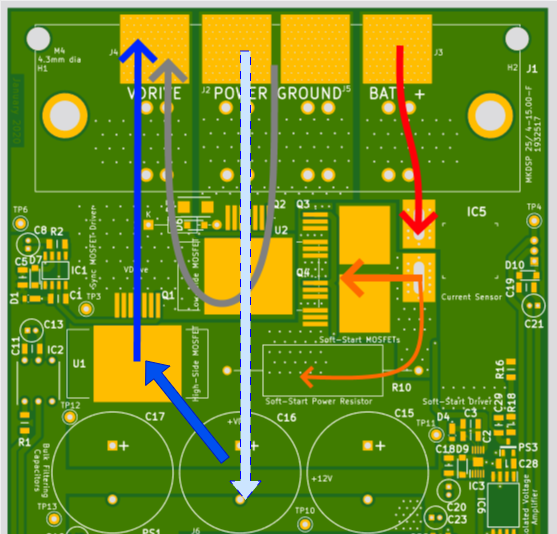
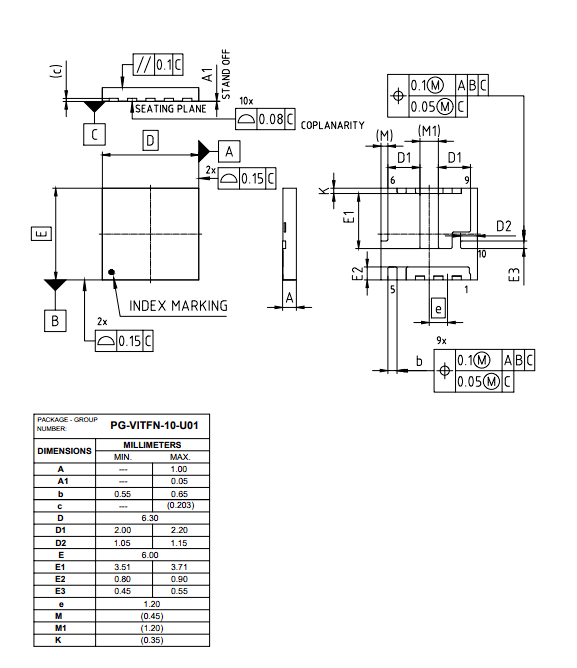
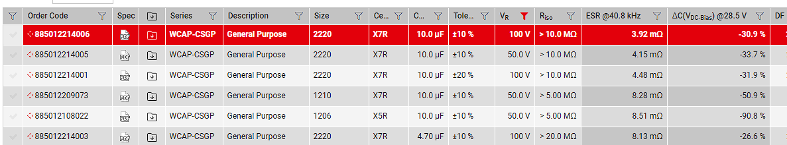

# Primary Areas of Concern in Redesigned Electrical Circuit

## 1. Multiple PCBs for use in Motor Driving

Motor Controller can be built from sub components such as power stages and single board computers. This is would be the goal of the new system.

## 2. Power Consumption in Circuit
Overall Idle Power Consumption of the Circuit is:
X W
Broken down between DAQ and Power Electronics:
Power Electronics: Y W
DAQ: Z W

Oisin Anderson did an analysis estimating power consumption in the PCB, Here are the results:

This compares with the input power consumption of

## 3. Isolation Requirements

Analog Devices has Whitepapers discussing Grounding techniques.
1. [Staying Well Grounded](https://www.analog.com/en/resources/analog-dialogue/articles/staying-well-grounded.html): This document primarily relates to grounding between sensitive analogue circuitry and higher speed digital circuitry. Discussing the use of split ground planes and the use of signals and ground planes as microstrip antennas for the purpose of controlling impedance.
2. [Reducing Ground Bounce](https://www.analog.com/en/resources/analog-dialogue/articles/reducing-ground-bounce-in-dc-to-dc-converters.html): This document highlights the issues with ground loops and ground bounce. A primary concern in the Geec and the primary reason behind introducing further grounding.

The image above shows a possible issue with constant current in a grounded system. If the sensitive analogue circuitry was 10cm away from the equipment measuring it on the solid ground plane, this could result in a 7mV voltage difference compared to the circuit creating the signal. This is mostly eliminated in the split plane section because the voltage drop is proportional to the current flowing through the plane and with an analog only ground plane there will very low currents passing through the plane.

The image above shows the effects of ground bounce due to changing magnetic fields from different loop areas. In the case of the Geec these loop changes would be from the bulk capacitors to the terminals of the motor.

The above image shows a closer reality to the ground bounce effect.

Bringing this info into the current power electronics, the change in the ground loop would be as shown:

As shown in the figure from ADI the ground bounce can be seen between the ground source terminal of the low side FET and the Negative terminal of the Bulk input capacitor.
*A potential mitigating effect of this ground bounce is the loop area likely includes the whole loop to the motor, i.e. the change in loop area with the additional cm2 from the low side to high side is only a small percentage of total loop area.*

ADI provide a few methods of reducing ground bounce:

This cut to the ground plane for the input capactior will isolate the ground bounce to the high current path in line with the capacitor, keeping all other ground sections "isolated" from the ground bounce.

The [Infineon power block](https://www.infineon.com/part/ISG0613N04NM6H) integrates 2 power FETs in a half bridge configuration in one low profile package. The image below shows the package dimensions. The total width is 6.3mm meaning one 2510 or 2512 SMD Capacitor can be connected across and minimise the change in loop area betweent the high side conduction and low side conduction

Wurth, Murata and other MLCC manufacturers provide resources for capacitance of their products:

This would result in significantly lower bulk capacitances than the current power electronics, however a combination of MLCC capitors as close to the power FETs as possible and electrolytic capacitors a little further away would likely keep the loop inductances minimal.

A well designed layout seperating the high current path and the main control current path whilst utilising integrated packages and keeping bulk capacitance as close as possible to the switching FETs should mitigate the need for isolation.
**Investigation using current power electronics: Monitor the voltage between the ground terminal and the negative terminal of the capacitor in motor drive conditions**

# 4. Gate Drive and Power FET selection
